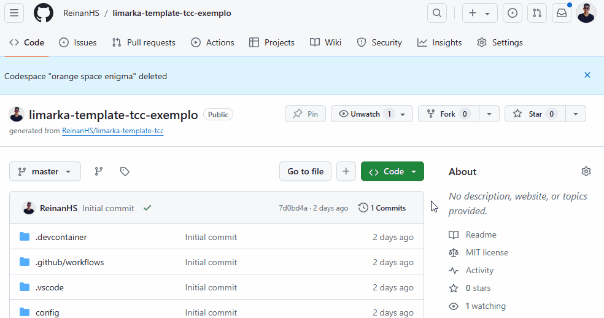

# GitHub Codespace

Para proporcionar uma experiência de desenvolvimento e escrita de documentos mais acessível e eficiente, configuramos nosso template para ser facilmente utilizado no GitHub Codespaces. O GitHub Codespaces oferece um ambiente de desenvolvimento completo, operável diretamente de seu navegador. Com recursos como um editor de código completo (VSCode), terminal, depurador e ferramentas essenciais, o GitHub Codespaces elimina a necessidade de configurações locais complexas.

## Pré-requisitos

Antes de começar, é essencial ter uma conta no GitHub. Recomendamos a associação a uma conta acadêmica, pois a criação de um Codespace pode incorrer em custos. Contas acadêmicas geralmente oferecem benefícios que podem incluir o uso reduzido ou gratuito do Codespaces, facilitando o acesso a este recurso.

## Criação do ambiente no Codespaces

Siga as instruções abaixo para configurar e iniciar seu ambiente de desenvolvimento no GitHub Codespaces:

### Acesso ao repositório

- **Login no GitHub**: Acesse [GitHub](https://github.com/) e faça login com sua conta.
- **Navegação até o repositório**: Dirija-se ao repositório que você criou usando nosso template.

### Inicialização do Codespace

- No canto superior direito da página do repositório, clique em "*Code*", seguido de "*Codespaces*".
- Selecione "*Create codespace on master*" (ou a branch principal do seu repositório) e siga as instruções na tela para iniciar o ambiente.

### Desenvolvimento no Codespace

- O ambiente Codespace será aberto em uma nova aba do navegador.
- Utilize o editor de código (VSCode), o terminal, o depurador e outras ferramentas disponíveis para desenvolver e escrever seu documento.
- Faça a instalação das extensões recomendadas para o VSCode.
- Todas as alterações feitas serão automaticamente sincronizadas e salvas no seu repositório.

## Exemplo de criação

Veja a exemplificação da imagem abaixo:

## Dicas de uso

- **Flexibilidade**: Você pode criar um Codespace para qualquer branch do seu repositório.
- **Colaboração**: Convide outros colaboradores para o seu Codespace para trabalhar em conjunto no desenvolvimento e na escrita do documento.
- **Compilação**: Execute a compilação do seu documento diretamente dentro do Codespace, aproveitando a configuração e as ferramentas já integradas.

## Conclusão

O GitHub Codespaces é uma poderosa solução para desenvolvedores e escritores que buscam maximizar sua produtividade com mínima configuração prévia. Ao seguir este guia, você poderá aproveitar plenamente as vantagens oferecidas pelo nosso template no ambiente configurado do Codespaces, garantindo uma experiência de escrita e desenvolvimento ágil e colaborativa.
