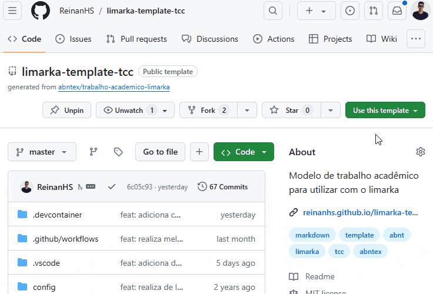
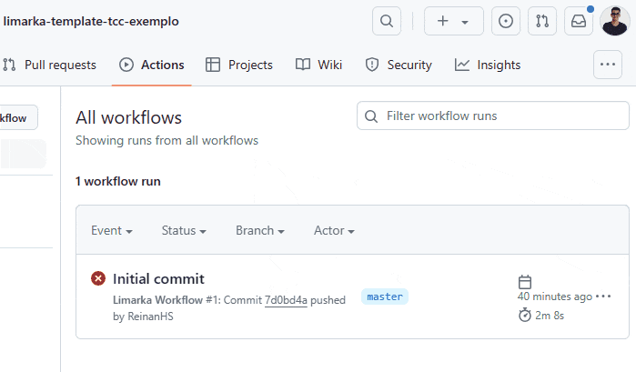
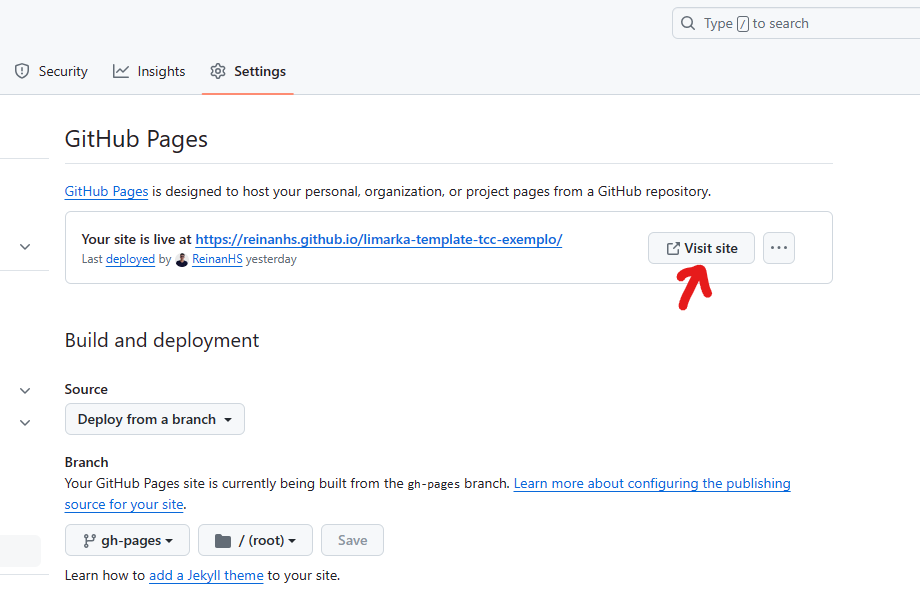
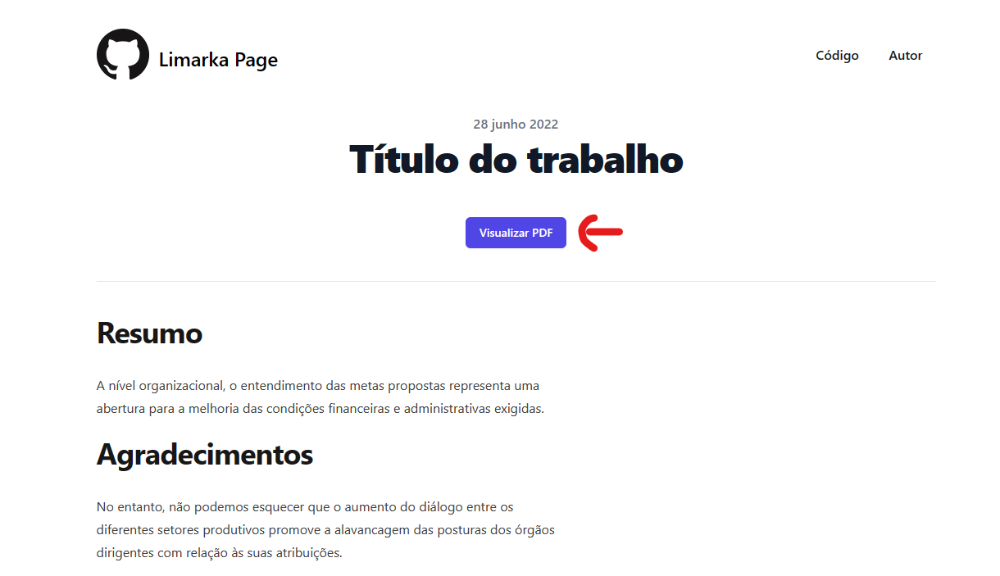

# Criação do repositório

Este documento oferece instruções detalhadas para a criação do repositório e configuração do template destinado à criação de documentos acadêmicos. Ele é elaborado para usuários que desejam utilizar este template para desenvolver ou redigir seus trabalhos no ambiente GitHub ou localmente em suas máquinas.

## Pré-requisitos

Antes de iniciar o processo de criação do repositório, certifique-se de que os seguintes pré-requisitos estão atendidos:

- Uma conta ativa no [GitHub](https://github.com/).
- O software [Git](https://git-scm.com/) instalado no seu computador.
- O software [Visual Studio Code](https://code.visualstudio.com/) instalado no seu computador.

## Criação de um repositório

Para utilizar o template em seus projetos, siga as instruções abaixo para criar um novo repositório na sua conta do GitHub, usando o nosso template como ponto de partida.

1. Acesse o projeto Limarka-TCC no GitHub através do link: https://github.com/ReinanHS/limarka-template-tcc.
2. Clique no botão "*Use this template*", localizado próximo ao topo da página.
3. Na tela seguinte, clique em "*Create a new repository*" para iniciar a criação de seu novo projeto.
4. Escolha um nome descritivo e memorável para o seu repositório.
5. Selecione a visibilidade do seu projeto:
    - **Público**: Permite que qualquer pessoa visualize e faça download do seu projeto.
    - **Privado**: Restringe o acesso ao projeto, sendo visível e acessível apenas por você e colaboradores convidados.
6. Finalize o processo clicando no botão "*Create repository*". 

Abaixo está um exemplo ilustrativo das etapas mencionadas:

## Configuração do repositório

Após criar o seu repositório utilizando o template, é necessário configurar algumas permissões específicas para que as funcionalidades de Integração Contínua e Entrega Contínua (CI/CD) operem corretamente através do GitHub Actions. Este segmento da documentação orienta você através desse processo.

Para ajustar as permissões e garantir que o GitHub Actions funcione sem interrupções, siga os passos abaixo:

### Acesso às configurações do repositório

1. Acesse o GitHub e navegue até o seu repositório.
2. Clique na aba "*Settings*" localizada na barra superior do repositório.

### Ajuste das permissões

1. Na barra lateral esquerda, selecione "*Actions*" para acessar as configurações de Actions.
2. Dentro da seção "*Actions*", clique em "*General*" para visualizar as configurações gerais.
3. Procure pela seção "*Workflow permissions*".
4. Altere as permissões do workflow para "*Read and write permissions*", permitindo que o workflow tenha acesso de leitura e escrita no repositório.
5. Salve as alterações clicando em "*Save changes*".

Veja o exemplo da imagem abaixo:

### Executando novamente o Workflow

Caso o primeiro workflow tenha falhado devido a problemas de permissão, é possível reexecutá-lo seguindo estes passos:

1. Retorne à página inicial do seu repositório no GitHub.
2. Acesse a aba "*Actions*", encontrada na barra de menu superior.
3. Localize o workflow que falhou e clique nos três pontos verticais ao lado para acessar mais opções.
4. Selecione "*View workflow file*" para visualizar os detalhes do arquivo do workflow.
5. Clique em "*Re-run jobs*" para iniciar novamente os jobs.
6. Escolha "*Re-run failed jobs*" para reexecutar apenas os jobs que falharam anteriormente.
7. Escolha "*Re-run jobs*" para reexecutar apenas os jobs de deploy.
8. Aguarde a finalização da execução e verifique se tudo ocorreu com sucesso.

Ao seguir estes passos, você garante que as configurações necessárias para a execução do CI/CD no GitHub Actions estejam corretas, permitindo a automação de testes, compilações e outras tarefas definidas no workflow do seu projeto.

Veja o exemplo abaixo:

## Configuração do GitHub Pages

Após a conclusão bem-sucedida das configurações de CI/CD e a resolução de erros de permissão, o próximo passo envolve a configuração do GitHub Pages. Essa plataforma permite a publicação de páginas web diretamente a partir de um repositório no GitHub, tornando-se uma ferramenta valiosa para a apresentação de projetos, documentações ou mesmo trabalhos acadêmicos. Siga as instruções abaixo para configurar o GitHub Pages para o seu projeto.

### Acesso às configurações do repositório

1. Acesse o GitHub e navegue até o seu repositório.
2. Clique na aba "*Settings*" localizada na barra superior do repositório.

### Ativação do GitHub Pages

1. No menu lateral esquerdo, procure e clique em "*Pages*" para acessar as configurações do GitHub Pages.
2. Dentro da seção "*Source*", você precisará definir a origem dos arquivos que serão utilizados pelo GitHub Pages:
   - Selecione "*Branch*" como a opção de fonte.
   - No menu suspenso de "*Branch*", escolha a branch `gh-pages`.
3. Clique no botão "*Save*" para aplicar as alterações.

Após realizar essas etapas, o GitHub salvará as configurações e iniciará a publicação do seu site usando os arquivos encontrados na branch `gh-pages`. Esse processo automatiza a disponibilização do conteúdo, facilitando o acesso e a distribuição de informações relevantes do seu projeto.

### Visualização do GitHub Pages

Após configurar o GitHub Pages e finalizar as etapas de compilação do seu documento, você terá a opção de visualizar o conteúdo publicado diretamente através da interface do GitHub. Esta seção detalha como acessar e visualizar seu documento no formato web, bem como o PDF compilado do seu trabalho.

#### Acesso ao site do GitHub Pages

Uma vez que o GitHub Pages esteja configurado e o documento compilado, o GitHub iniciará automaticamente a publicação do seu trabalho na web. Para acessar seu documento:

1. Acesse a Página de Configuração do GitHub Pages:
   - Vá para a aba "*Settings*" do seu repositório no GitHub.
   - Navegue até a seção "*Pages*" no menu lateral.
2. Visite o Site:
   - Localize o botão "*Visit site*" na página de configuração do GitHub Pages. Este botão pode levar algum tempo para ficar disponível, dependendo da duração do processo de compilação.
   - Clique em "*Visit site*" para ser redirecionado para a página web onde seu documento está publicado.

Veja o exemplo da imagem abaixo:

#### Visualizando o PDF compilado

Na página do GitHub Pages do seu documento, além de visualizar o conteúdo no formato web, há uma opção para acessar a versão em PDF do seu trabalho:

1. Visualize o PDF:
   - Procure pelo botão azul com a inscrição "Visualizar PDF".
   - Clique neste botão para abrir o arquivo PDF do seu documento compilado em uma nova aba ou janela do navegador.

Veja o exemplo da imagem abaixo:

